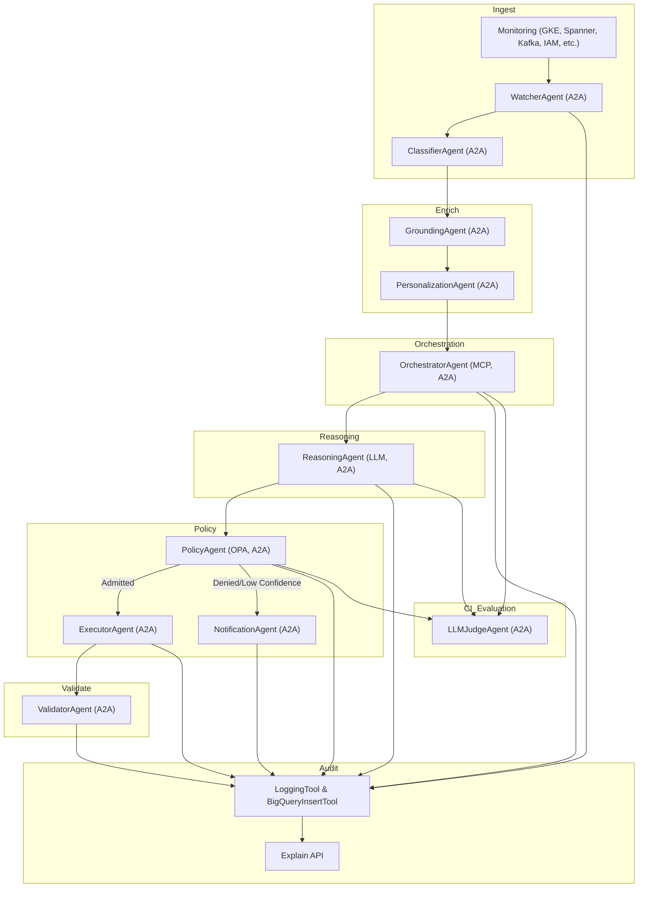

# HOWTO: x-sre-agents Setup, Development, and Langflow Integration

## A2A-Based Architecture

All agents in x-sre-agents are now implemented as [A2A protocol](https://github.com/a2aproject/A2A) endpoints. This enables secure, interoperable, and auditable workflows across clouds, organizations, and technology stacks.

- Each agent is a standalone A2A service, exposing its main method as a JSON-RPC endpoint.
- Agents can be orchestrated via A2A client calls, from workflow engines, Langflow, or custom scripts.
- The platform is fully modular, extensible, and production-grade.

## End-to-End Workflow Diagram (A2A)



## Running Agents as A2A Services

Each agent is a standalone A2A service. To run an agent:

```sh
python src/agents/classifier_agent.py      # Runs ClassifierAgent on port 8001
python src/agents/grounding_agent.py       # Runs GroundingAgent on port 8002
python src/agents/personalization_agent.py # Runs PersonalizationAgent on port 8003
python src/agents/orchestrator_agent.py    # Runs OrchestratorAgent on port 8004
python src/agents/reasoning_agent.py       # Runs ReasoningAgent on port 8005
python src/agents/policy_agent.py          # Runs PolicyAgent on port 8006
python src/agents/executor_agent.py        # Runs ExecutorAgent on port 8007
python src/agents/notification_agent.py    # Runs NotificationAgent on port 8008
python src/agents/validator_agent.py       # Runs ValidatorAgent on port 8009
python src/agents/watcher_agent.py         # Runs WatcherAgent on port 8010
python src/agents/llmjudge_agent.py        # Runs LLMJudgeAgent on port 8011
```

## Orchestrating the Workflow via A2A

- Use the [a2a-sdk](https://github.com/a2aproject/A2A) client to call each agent’s method over HTTP (JSON-RPC 2.0).
- Agents can be orchestrated from a workflow engine, Langflow, or custom Python scripts.
- Example (Python):

```python
from a2a_sdk import A2AClient

classifier = A2AClient('http://localhost:8001')
grounder = A2AClient('http://localhost:8002')
# ...
result = classifier.classify(signal, context)
grounding = grounder.ground(signal, result[0])
# ...
```

## A2A Deployment Steps

1. **Install dependencies:**
   ```sh
   pip install -r requirements.txt
   ```
2. **Run each agent as a service:**
   ```sh
   python src/agents/classifier_agent.py
   # ... (see above for all agents)
   ```
3. **Orchestrate the workflow:**
   - Use the a2a-sdk client, Langflow, or a workflow engine to call each agent’s endpoint.
   - Agents can be distributed across machines, clouds, or organizations.

## Interoperability Notes

- Agents can be distributed across clouds, orgs, or languages.
- Each agent publishes an Agent Card for discovery.
- All agent-to-agent calls are secure, auditable, and standards-based.

## Handling Non-Auto-Executable Solutions: Human-in-the-Loop Escalation

When the PolicyAgent determines that an LLM-proposed remediation action is NOT allowed to be auto-executed (due to policy, compliance, or risk), the system ensures that the solution is still delivered to human SREs for review and action.

### Workflow
1. **Incident is detected and classified** as usual (WatcherAgent, ClassifierAgent, etc.).
2. **ReasoningAgent** generates a proposed solution using LLM (Gemini CLI).
3. **PolicyAgent** evaluates the action proposal:
   - If **admitted**, ExecutorAgent proceeds as normal.
   - If **denied** or low confidence, **NotificationAgent** is invoked.
4. **NotificationAgent** calls `notify_with_solution`, sending a detailed Slack message to the SRE team.

### What the Slack Message Contains
- Incident summary (from WatcherAgent)
- Classification (from ClassifierAgent)
- LLM-proposed solution (from ReasoningAgent)
- Policy reason for non-execution (from PolicyAgent)
- Clear call to action for human review

#### Example Slack Message
```
🚨 Incident: High CPU usage detected on GKE node
🔍 Classification: scale
🤖 Proposed Solution (LLM):
  Scale up the node pool by 2 replicas using gcloud CLI.
❌ Action NOT auto-executed (policy: requires human approval)
👤 Please review and approve or escalate.
```

### Production-Grade Implementation (NotificationAgent)
- The `notify_with_solution` method is exposed as a JSON-RPC endpoint.
- It accepts `incident`, `action_proposal`, and `policy_result` as parameters.
- It formats and sends the message to Slack using the configured webhook.
- All notifications are logged for audit and troubleshooting.
- Handles errors gracefully and logs failures.

#### Example Usage in Workflow
```python
if not policy_result["admit"]:
    notification_agent.notify_with_solution(incident, action_proposal, policy_result)
```

### Why This Matters
- **No solution is lost:** Even if automation is blocked, the LLM’s recommendation reaches the right people.
- **Auditability:** All escalations are logged and traceable.
- **Human-in-the-loop:** Ensures safety, compliance, and operational control for sensitive actions.

## References
- [A2A Project on GitHub](https://github.com/a2aproject/A2A)
- [A2A Protocol Documentation](https://a2aproject.github.io/A2A/)

---

_Last updated: [A2A refactor complete]_ 