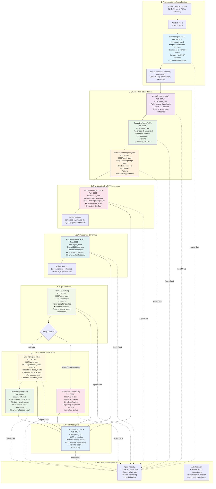
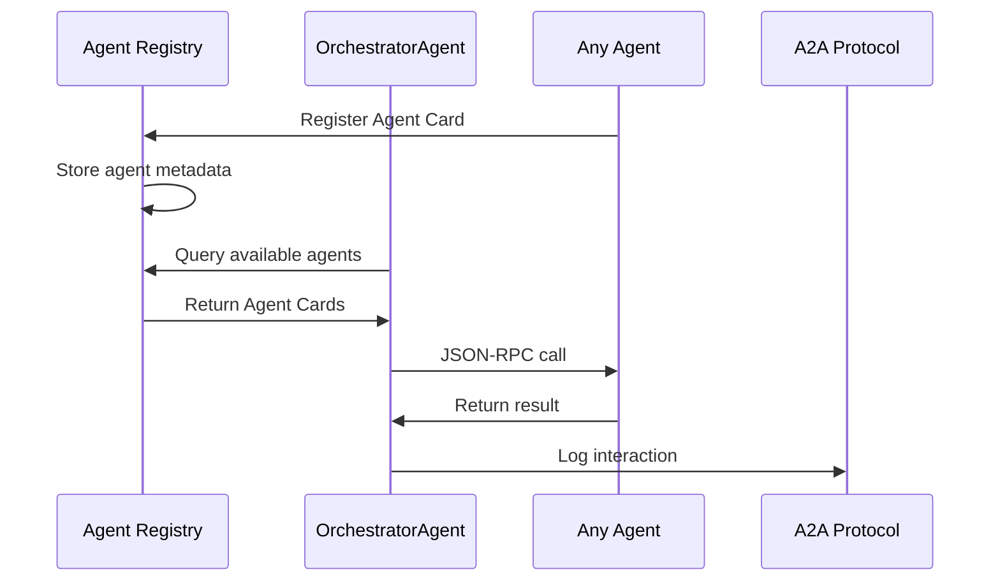
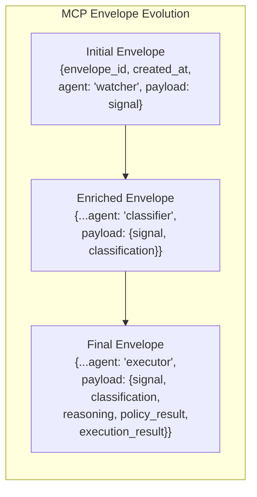

# x-sre-agents

## Overview

x-sre-agents is an enterprise-grade, production-ready SRE automation platform built on a modular, agentic architecture. Each agent is implemented as an [A2A protocol](https://github.com/a2aproject/A2A) endpoint, enabling secure, interoperable, and auditable workflows across clouds, organizations, and technology stacks.

- **Platform-agnostic:** Ingests and remediates alerts from any Google Cloud or custom source.
- **A2A-enabled:** All agents expose their core methods as JSON-RPC endpoints using the [a2a-sdk](https://github.com/a2aproject/A2A).
- **LLM-powered:** Uses Gemini CLI for reasoning and CI/CD evaluation.
- **MCP-compliant:** All actions are signed and auditable via Managed Control Plane envelopes.
- **Extensible:** Plug-and-play new agents, tools, or integrations with zero code changes.

## End-to-End Architecture & Workflow

### Complete System Design



### Detailed Workflow Steps

#### **Step 1: Alert Ingestion & Normalization**
1. **Source**: Google Cloud Monitoring detects issues (high CPU, pod failures, etc.)
2. **Pub/Sub**: Alerts are published to a Pub/Sub topic
3. **WatcherAgent**: 
   - Listens to Pub/Sub subscription
   - Normalizes alerts to standard `Signal` format
   - Creates initial MCP envelope with audit trail
   - Logs to Cloud Logging with structured data

#### **Step 2: Classification & Enrichment**
4. **ClassifierAgent**:
   - Uses rules engine for fast classification
   - Falls back to Gemini CLI for complex cases
   - Returns action type (scale, restart, investigate)
5. **GroundingAgent**:
   - Performs vector search on documentation
   - Retrieves relevant runbooks and KB articles
   - Provides context for reasoning
6. **PersonalizationAgent**:
   - Injects organization-specific prompts
   - Applies custom policies and procedures
   - Ensures compliance with org standards

#### **Step 3: Orchestration & MCP Management**
7. **OrchestratorAgent**:
   - Creates MCP envelope with full context
   - Signs envelope for audit trail
   - Routes to next agent in workflow
   - Persists envelope to BigQuery for audit

#### **Step 4: LLM Reasoning & Planning**
8. **ReasoningAgent**:
   - Uses Gemini CLI for natural language reasoning
   - Analyzes root cause of the incident
   - Proposes specific remediation actions
   - Returns structured ActionProposal

#### **Step 5: Policy Validation**
9. **PolicyAgent**:
   - Integrates with OPA Gatekeeper
   - Validates proposed actions against policies
   - Ensures security and compliance
   - Returns admit/deny decision with confidence

#### **Step 6: Execution & Validation**
10. **ExecutorAgent** (if admitted):
    - Executes approved actions on GCP resources
    - Uses Google Cloud SDKs and CLI tools
    - Logs all actions for audit
    - Returns execution results
11. **NotificationAgent** (if denied):
    - Sends escalations to Slack/email
    - Notifies on-call engineers
    - Creates incident tickets
12. **ValidatorAgent**:
    - Verifies post-execution system health
    - Queries BigQuery for metrics
    - Checks Kubernetes cluster state
    - Confirms incident resolution

#### **Step 7: Quality Assurance**
13. **LLMJudgeAgent**:
    - Evaluates entire workflow quality
    - Scores effectiveness of remediation
    - Provides improvement suggestions
    - Used for CI/CD pipeline validation

### Agent Discovery & Interoperability



### Data Flow & MCP Envelope Structure



## Running Agents as A2A Services

Each agent is a standalone A2A service with dual discovery methods:

### **JSON-RPC Endpoints (A2A Protocol)**
```sh
python src/agents/classifier_agent.py      # Runs ClassifierAgent on port 8001
python src/agents/grounding_agent.py       # Runs GroundingAgent on port 8002
python src/agents/personalization_agent.py # Runs PersonalizationAgent on port 8003
python src/agents/orchestrator_agent.py    # Runs OrchestratorAgent on port 8004
python src/agents/reasoning_agent.py       # Runs ReasoningAgent on port 8005
python src/agents/policy_agent.py          # Runs PolicyAgent on port 8006
python src/agents/executor_agent.py        # Runs ExecutorAgent on port 8007
python src/agents/notification_agent.py    # Runs NotificationAgent on port 8008
python src/agents/validator_agent.py       # Runs ValidatorAgent on port 8009
python src/agents/watcher_agent.py         # Runs WatcherAgent on port 8010
python src/agents/llmjudge_agent.py        # Runs LLMJudgeAgent on port 8011
```

### **HTTP REST Endpoints (Agent Card Discovery)**
Each agent also serves its Agent Card at:
- `http://localhost:9000/agent_card` (WatcherAgent)
- `http://localhost:9001/agent_card` (ClassifierAgent)
- `http://localhost:9002/agent_card` (GroundingAgent)
- And so on...

## Orchestrating the Workflow via A2A

### **Using A2A SDK Client**
```python
from a2a_sdk import A2AClient

# Initialize clients for each agent
classifier = A2AClient('http://localhost:8001')
grounder = A2AClient('http://localhost:8002')
personalizer = A2AClient('http://localhost:8003')
orchestrator = A2AClient('http://localhost:8004')
reasoner = A2AClient('http://localhost:8005')
policy = A2AClient('http://localhost:8006')
executor = A2AClient('http://localhost:8007')
validator = A2AClient('http://localhost:8009')

# Execute workflow
signal = {"message": "High CPU usage detected", "severity": "critical"}
context = {"org": "prod", "environment": "gke-cluster-1"}

# Step 1: Classify
classification, method = classifier.classify(signal, context)

# Step 2: Ground
grounding = grounder.ground(signal, classification)

# Step 3: Personalize
examples = personalizer.personalize(context, grounding)

# Step 4: Orchestrate
mcp_envelope = orchestrator.orchestrate({
    "envelope_id": "env-123",
    "agent": "orchestrator",
    "payload": {"signal": signal, "classification": classification}
})

# Step 5: Reason
action_proposal = reasoner.reason(mcp_envelope, grounding, examples)

# Step 6: Policy Check
policy_result = policy.policy_check(action_proposal)

# Step 7: Execute (if admitted)
if policy_result["admit"]:
    execution_result = executor.execute(action_proposal)
    validation_result = validator.validate(execution_result)
```

### **Using HTTP REST (Agent Card Discovery)**
```bash
# Discover agent capabilities
curl http://localhost:9000/agent_card
curl http://localhost:9001/agent_card
# ... etc

# Example response:
{
  "id": "watcher-agent",
  "name": "WatcherAgent", 
  "endpoint": "http://localhost:8010/jsonrpc",
  "methods": ["ingest_alert", "get_agent_card"],
  "description": "Ingests and normalizes alerts from Pub/Sub and other sources.",
  "version": "1.0.0",
  "owner": "SRE Automation Team"
}
```

## Key Features

### **A2A Protocol Compliance**
- All agents expose JSON-RPC 2.0 endpoints
- Agent Cards for discovery and capability negotiation
- Secure, standards-based communication
- Interoperable across different implementations

### **MCP (Model Context Protocol) Integration**
- All actions wrapped in signed MCP envelopes
- Full audit trail from ingestion to execution
- BigQuery persistence for compliance
- Digital signatures for integrity

### **LLM Integration (Gemini CLI)**
- **ClassifierAgent**: Fallback classification when rules are insufficient
- **ReasoningAgent**: Root cause analysis and remediation planning
- **PersonalizationAgent**: Org-specific prompt injection
- **LLMJudgeAgent**: CI/CD evaluation and quality scoring

### **Security & Compliance**
- **PolicyAgent**: OPA Gatekeeper integration for policy enforcement
- **ExecutorAgent**: Isolated execution with least privilege
- **ValidatorAgent**: Post-execution validation and health checks
- **NotificationAgent**: Escalation and incident management

### **Enterprise Features**
- Structured logging to Cloud Logging
- BigQuery persistence for analytics
- Agent discovery and health monitoring
- Extensible architecture for new agents/tools

## Interoperability Notes

- Agents can be distributed across clouds, orgs, or languages
- Each agent publishes an Agent Card for discovery
- All agent-to-agent calls are secure, auditable, and standards-based
- MCP envelopes ensure full traceability and compliance

## References
- [A2A Project on GitHub](https://github.com/a2aproject/A2A)
- [A2A Protocol Documentation](https://a2aproject.github.io/A2A/)
- [Google Cloud Monitoring](https://cloud.google.com/monitoring)
- [OPA Gatekeeper](https://open-policy-agent.github.io/gatekeeper/)
